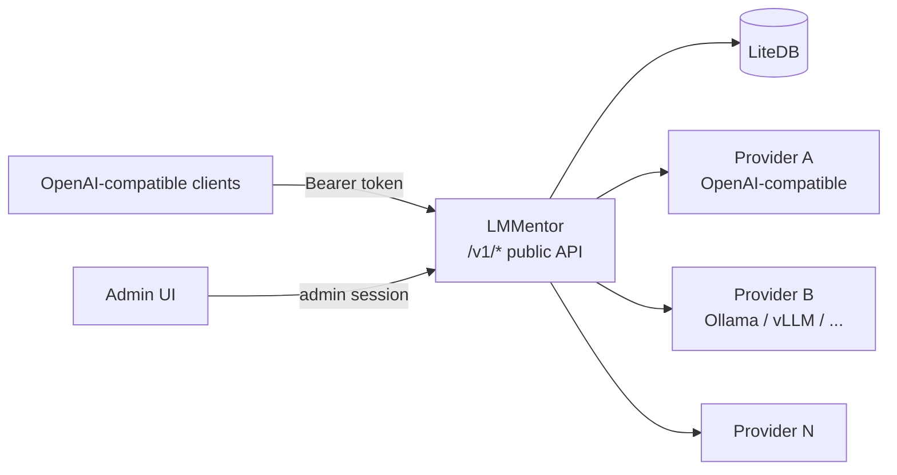

# LMMentor — LLM Aggregator

## Overview

**LMMentor** is a lightweight, self-hosted LLM aggregator written in C# / ASP.NET Core (Native AOT). It sits in front of multiple OpenAI-compatible LLM providers, aggregates their models behind a single OpenAI-compatible API endpoint, and provides a simple web UI for administration.

Think of it as a small, opinionated, single-binary alternative to [LiteLLM](https://github.com/BerriAI/litellm).

## Core Value Proposition

- **One binary, zero dependencies**: .NET Native AOT compilation produces a single self-contained executable. No Python runtime, no virtualenv, no heavy dependency tree.
- **LiteDB persistence**: all state (providers, models, tokens, usage metrics) lives in a single local LiteDB file. Pure managed C#, trivially backed up, trivially deployed.
- **OpenAI-compatible in, OpenAI-compatible out**: any client that speaks the OpenAI API (`/v1/chat/completions`, `/v1/models`, etc.) can point at LMMentor with just a base URL and an API key change.
- **Low latency, low memory by design**: LMMentor is a thin relay — it streams tokens straight through to the client without buffering full responses, and keeps its own footprint small so it never becomes the bottleneck in front of the models.

## Key Features

### 1. Multi-Provider Configuration
- Configure multiple upstream entrypoints, each speaking the OpenAI-compatible API (OpenAI, Azure OpenAI, Ollama, vLLM, LM Studio, Together, Groq, etc.).
- Each provider entry: name, base URL, API token, optional model allow/deny list.

### 2. Automatic Model Discovery
- On startup and on demand, LMMentor queries each provider's `GET /v1/models` endpoint.
- Detects available models and their context sizes (from the provider response when available, e.g. `max_model_len`, or via a probe request as fallback).
- Models are cached locally; refresh is triggered per endpoint from the UI. There is no background polling, so each refresh re-reads the catalog and the current context size reported by the provider.

### 3. Model Curation
- Through the UI, the admin selects which discovered models are **exposed** through the aggregator's public endpoint.
- Exposed models can be given friendly names/aliases so downstream clients see a clean, stable model catalog regardless of upstream naming.

### 4. Single OpenAI-Compatible Endpoint
- `GET /v1/models` — lists only the exposed models (with context sizes).
- `POST /v1/chat/completions` — routes to the correct upstream provider based on the requested model; supports streaming (SSE) pass-through.
- Standard OpenAI request/response shapes, so existing SDKs and tools work unchanged.

### 5. Usage Tracking & Metrics
Per call, per model, aggregated over a configurable window (1–90 days):
- Number of calls (total and per day)
- Input tokens / output tokens (from upstream `usage` responses; the relay injects `stream_options.include_usage` into streaming requests so usage is available in the final SSE chunk)
- Total tokens
- Average **tokens per second** over the window (total tokens ÷ window duration), plus average tokens per day
- Breakdowns by model and by API key, and a daily trend series for charts

Metrics are queryable through the UI (dashboard with per-model/per-key breakdowns, daily trends, and avg tokens/sec).

Usage is recorded off the response path: the relay enqueues entries into an in-memory channel (`UsageLogger`) that a background consumer persists to LiteDB, so logging never adds latency to the streamed response. The dashboard query filters by date directly in LiteDB (`Query.GTE` on `timestamp`) instead of loading the whole collection.

### 6. API Key Management
- Admins can create scoped API keys (prefixed `sk-lm-`) for LMMentor's own public API.
- Keys can be named, optionally restricted to specific models, and revoked or deleted at any time.
- The full key value is shown only once, at creation time; afterwards only a masked form is stored/displayed.
- All requests to the public endpoint must present a valid key (`Authorization: Bearer sk-lm-...`).

### 7. Admin UI & Bootstrapped Credentials
- React SPA (Vite + TypeScript + [Mantine](https://mantine.dev/) components, `src/LMMentor.AdminUI/`) served by the backend under `/admin/` for:
  - Managing upstream endpoints (add/remove, refresh status + model discovery)
  - Renaming models and toggling model exposure
  - Creating/revoking/deleting API keys
  - Viewing usage metrics (dashboard with daily trend, per-model and per-key breakdowns)
- **Front-end**: the admin UI is a React SPA built with Vite, TypeScript, Mantine, TanStack Query, and Recharts (`src/LMMentor.AdminUI/`); its production build is emitted into `LMMentor.Backend/wwwroot` and served statically by the backend, keeping the single-binary deployment.
- **Dev mode**: in `Development`, the backend starts the Vite dev server (strict port 5173) and proxies `/admin/*` to it for HMR; set `LMMENTOR_DEV_PROXY=false` to serve the static build instead.
- **Admin auth**: cookie-based session (HttpOnly, SameSite=Lax, 8h sliding). API routes under `/api` return 401/403 instead of redirecting so the SPA can handle login.
- **First-run bootstrap**: on first startup, LMMentor generates an admin username + password, prints them to the console, and stores a hash in LiteDB. Subsequent logins use those credentials; no external identity provider required.

## Architecture Sketch



### Project Layout (current)

```
lmmentor/
├── assets/                         # Shared visual identity (README + AdminUI)
│   ├── logo.svg / favicon.svg / icons.svg / readme-logo.png
├── src/
│   ├── LMMentor.slnx               # Solution file (all projects live under src/)
│   ├── LMMentor.Backend/           # ASP.NET Core Native AOT backend (Minimal APIs)
│   │   ├── Program.cs              # Entrypoint: DI, cookie auth, Vite dev proxy, routing
│   │   ├── Admin/
│   │   │   ├── AuthEndpoints.cs    # Login/logout/me + first-run credential bootstrap
│   │   │   ├── ApiEndpoints.cs     # /api admin API (endpoints, models, keys, usage)
│   │   │   └── RelayEndpoints.cs   # Public OpenAI-compatible /v1/* relay
│   │   ├── Data/                   # LiteDB services + entities
│   │   │   ├── LMMentorDb.cs       # DB bootstrap (LMMENTOR_DB_PATH, default ./lmmentor.db)
│   │   │   ├── EndpointService.cs  # Endpoint CRUD + model sync on refresh
│   │   │   ├── ModelDiscoveryService.cs  # OpenAI-compatible /models + Ollama /api/tags
│   │   │   ├── ApiKeyService.cs    # sk-lm-... key creation/revocation (SHA-256 hash at rest)
│   │   │   ├── AdminCredentialService.cs / PasswordHasher.cs
│   │   │   ├── RelayService.cs     # Model resolution + upstream relay (SSE pass-through)
│   │   │   ├── UsageLogger.cs      # Bounded-channel queue, background persistence
│   │   │   ├── UsageService.cs     # Dashboard aggregation over a day window
│   │   │   └── Entities/           # ApiEndpointEntity, ModelEntity, ApiKeyEntity, ...
│   │   ├── Dev/                    # Vite dev server + /admin proxy (Development only)
│   │   └── wwwroot/                # Built Admin UI static assets (Vite output)
│   └── LMMentor.AdminUI/           # Admin front-end: React SPA (Vite + TypeScript + Mantine)
│       ├── src/
│       │   ├── main.tsx / App.tsx
│       │   ├── api/                # Typed clients + TanStack Query hooks
│       │   └── pages/              # Login, Dashboard, Endpoints, Keys
│       ├── index.html
│       ├── vite.config.ts          # Build output → LMMentor.Backend/wwwroot (base /admin/)
│       └── package.json
├── Dockerfile                      # Multi-stage: Vite build → AOT publish → static binary
├── docker-compose.yml              # Host-network container, /data volume for the DB file
└── IDEA.md
```

### Data Model (LiteDB collections)

| Collection | Purpose |
|---|---|
| `api_endpoints` | name, type (openai/deepseek/ollama/groq/vllm/lmstudio/llamacpp/unsloth/custom), url, access_token, status (online/offline), last_checked_at, created_at |
| `models` | endpoint_id, upstream_model_id, display_name (empty = upstream name), context_size, enabled, created_at |
| `api_keys` | SHA-256 hash of the key, name, allowed model ids (null = all), created_at, revoked_at |
| `usage_log` | timestamp, model_id, api_key_id, prompt_tokens, completion_tokens, total_tokens, success — one row per relayed request; dashboard aggregates on read over a day window |
| `admin_credentials` | hashed admin password (bootstrap) |

## Technical Decisions

- **Runtime**: .NET 10 ASP.NET Minimal APIs, published with Native AOT (`PublishAot=true`) for a single static binary.
- **Admin UI stack**: React + TypeScript + Vite, using [Mantine](https://mantine.dev/) for components (forms, tables, charts via `@mantine/charts`); built assets are embedded in the backend and served statically.
- **HTTP client**: `IHttpClientFactory` / named clients per provider; SSE streaming via `HttpCompletionOption.ResponseHeadersRead`.
- **Persistence**: [LiteDB](https://www.litedb.org/) — a single-file, pure managed C# NoSQL database. No native interop, which keeps Native AOT compilation clean; entities map directly to `BsonDocument` collections.
- **Token counting**: prefer upstream-reported usage; fall back to a lightweight local estimator when providers omit it.
- **Secrets handling**: admin passwords use PBKDF2 hashes and public API keys use SHA-256 hashes. A newly generated `sk-lm-...` value is shown only once, at creation.
- **No external services**: no Redis, no Postgres, no message queue — everything fits in one process and one file.
- **Latency & memory-conscious relaying**: the aggregator adds as little overhead as possible between client and model.
  - Stream SSE responses token-by-token (`HttpCompletionOption.ResponseHeadersRead` + async pipe/copy) instead of accumulating the full body; time-to-first-token is dominated by the upstream, not by LMMentor.
  - Avoid re-serializing/parsing payloads where possible — forward request bodies and stream chunks with minimal copying (no intermediate `string` materialization of large payloads).
  - Keep per-request allocations low and reuse buffers; metrics/usage accounting is done incrementally from streamed `usage` data rather than by holding whole conversations in memory.
  - Connection pooling via `IHttpClientFactory` to upstreams to avoid repeated TLS handshakes on the hot path.
  - Target: LMMentor's own added latency (excluding upstream generation) should be negligible, and steady-state memory should stay flat regardless of response size.

## Non-Goals (v1)

- Load balancing / failover across providers for the *same* model (routing is deterministic: model → provider).
- Prompt management, fine-tuning, embeddings passthrough beyond basic proxying.
- Multi-tenant SaaS features; this is a single-admin self-hosted tool.
- Non-OpenAI upstream protocols (Anthropic-native, etc.) — adapters can come later.

## Milestones

1. ~~**M1 — Skeleton**~~ ✅ AOT app boots, LiteDB database initialized, admin credentials bootstrapped and printed to console, minimal UI shell.
2. ~~**M2 — Providers & Discovery**~~ ✅ Add/remove endpoints via UI, model discovery (OpenAI-compatible + Ollama) with context sizes, rename models, expose/unexpose models.
3. ~~**M3 — Public API**~~ ✅ Key-gated `/v1/models` + `/v1/chat/completions` (incl. SSE streaming pass-through) routed to upstreams.
4. ~~**M4 — Metrics**~~ ✅ Per-call logging and dashboard aggregation (daily trend, per-model/per-key breakdowns, avg tokens/sec over the window), with date filtering done in LiteDB.
5. **M5 — Ongoing Hardening**: latency/memory profiling of the relay path, automated tests, release artifacts, and CI automation. Endpoint editing remains out of scope.
