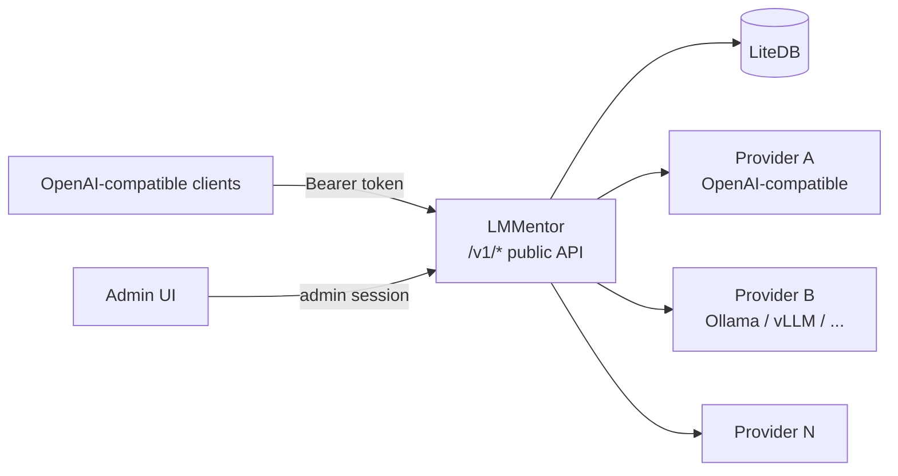

# LMMentor — LLM Aggregator

## Overview

**LMMentor** is a lightweight, self-hosted LLM aggregator written in C# / ASP.NET Core (Native AOT). It sits in front of multiple OpenAI-compatible LLM providers, aggregates their models behind a single OpenAI-compatible API endpoint, and provides a simple web UI for administration.

Think of it as a small, opinionated, single-binary alternative to [LiteLLM](https://github.com/BerriAI/litellm).

## Core Value Proposition

- **One binary, zero dependencies**: .NET Native AOT compilation produces a single self-contained executable. No Python runtime, no virtualenv, no heavy dependency tree.
- **LiteDB persistence**: all state (providers, models, tokens, usage metrics) lives in a single local LiteDB file. Pure managed C#, trivially backed up, trivially deployed.
- **OpenAI-compatible in, OpenAI-compatible out**: any client that speaks the OpenAI API (`/v1/chat/completions`, `/v1/models`, etc.) can point at LMMentor with just a base URL and an API key change.
- **Low latency, low memory by design**: LMMentor is a thin relay — it streams tokens straight through to the client without buffering full responses, and keeps its own footprint small so it never becomes the bottleneck in front of the models.

## Key Features

### 1. Multi-Provider Configuration
- Configure multiple upstream entrypoints, each speaking the OpenAI-compatible API (OpenAI, Azure OpenAI, Ollama, vLLM, LM Studio, Together, Groq, etc.).
- Each provider entry: name, base URL, API token, optional model allow/deny list.

### 2. Automatic Model Discovery
- On startup and on demand, LMMentor queries each provider's `GET /v1/models` endpoint.
- Detects available models and their context sizes (from the provider response when available, e.g. `max_model_len`, or via a probe request as fallback).
- Models are cached locally; refresh is manual (UI button) or on a configurable interval.

### 3. Model Curation
- Through the UI, the admin selects which discovered models are **exposed** through the aggregator's public endpoint.
- Exposed models can be given friendly names/aliases so downstream clients see a clean, stable model catalog regardless of upstream naming.

### 4. Single OpenAI-Compatible Endpoint
- `GET /v1/models` — lists only the exposed models (with context sizes).
- `POST /v1/chat/completions` — routes to the correct upstream provider based on the requested model; supports streaming (SSE) pass-through.
- Standard OpenAI request/response shapes, so existing SDKs and tools work unchanged.

### 5. Usage Tracking & Metrics
Per call, per model, aggregated daily:
- Number of calls (total and per day)
- Input tokens / output tokens (from upstream `usage` responses; estimated via tokenizer when absent)
- Total tokens
- Cache hit / miss counts (prompt caching reported by providers, e.g. `cached_tokens`)
- Generation speed: wall-clock generation time per call, enabling **average tokens per second** per model (output tokens ÷ generation time), shown as a rolling/daily average on the dashboard

Metrics are queryable through the UI (dashboard with per-model breakdowns, daily trends, and avg tokens/sec).

### 6. API Token Management
- Admins can create scoped API tokens for LMMentor's own public API.
- Tokens can be named, optionally restricted to specific models, and revoked at any time.
- All requests to the public endpoint must present a valid token (`Authorization: Bearer <token>`).

### 7. Admin UI & Bootstrapped Credentials
- React SPA (Vite + TypeScript + [Mantine](https://mantine.dev/) components, `src/LMMentor.AdminUI/`) served by the backend for:
  - Managing providers (add/edit/remove, test connection)
  - Refreshing model discovery and toggling model exposure
  - Creating/revoking API tokens
  - Viewing usage metrics
- **Front-end**: the admin UI is a React SPA built with Vite, TypeScript, and the [Mantine](https://mantine.dev/) component library (`src/LMMentor.AdminUI/`); its production build is embedded into / served statically by the LMMentor backend, keeping the single-binary deployment.
- **First-run bootstrap**: on first startup, LMMentor generates an admin username + password (or admin token), prints them to the console, and stores a hash in LiteDB. Subsequent logins use those credentials; no external identity provider required.

## Architecture Sketch



### Suggested Project Layout

```
lmmentor/
├── src/
│   ├── LMMentor.slnx               # Solution file (all projects live under src/)
│   ├── LMMentor/                   # ASP.NET Core AOT backend (API + admin server)
│   │   ├── Program.cs              # AOT entrypoint, DI wiring
│   │   ├── Api/                    # Public OpenAI-compatible endpoints
│   │   │   ├── ChatCompletionsEndpoint.cs
│   │   │   └── ModelsEndpoint.cs
│   │   ├── Admin/                  # Admin API (consumed by the SPA)
│   │   │   ├── Auth/               # Bootstrap credentials, session/token auth
│   │   │   ├── ProvidersController.cs
│   │   │   ├── TokensController.cs
│   │   │   └── MetricsController.cs
│   │   ├── Upstream/               # Provider clients, model discovery, routing
│   │   │   ├── IProviderClient.cs
│   │   │   ├── OpenAiCompatibleClient.cs
│   │   │   └── ModelDiscovery.cs
│   │   ├── Data/                   # LiteDB (BsonDocument collections)
│   │   │   ├── LMMentorDb.cs
│   │   │   └── Entities/           # Provider, Model, ApiToken, UsageDaily...
│   │   └── Metrics/                # Token counting, cache hit/miss accounting
│   ├── LMMentor.AdminUI/           # Admin front-end: React SPA (Vite + TypeScript + Mantine)
│   │   ├── src/
│   │   │   ├── main.tsx
│   │   │   ├── App.tsx
│   │   │   ├── api/                # Typed clients for the admin API
│   │   │   └── pages/              # Providers, Models, Tokens, Metrics/Dashboard
│   │   ├── index.html
│   │   ├── vite.config.ts          # Dev proxy to backend; build output served by LMMentor
│   │   └── package.json
│   └── LMMentor.Tests/             # xUnit test project (inside src/, part of the slnx)
└── IDEA.md
```

### Data Model (LiteDB collections)

| Collection | Purpose |
|---|---|
| `providers` | name, base_url, api_token (encrypted at rest), enabled, discovery settings |
| `models` | provider_id, upstream_model_id, display_name, context_size, exposed |
| `api_tokens` | token hash, name, allowed model ids (nullable = all), created_at, revoked_at |
| `usage_calls` | timestamp, model_id, token_id, input_tokens, output_tokens, cache_hit/miss, latency_ms, generation_time_ms |
| `usage_daily` | pre-aggregated per day/model: calls, tokens in/out/total, cache hits/misses, avg tokens/sec (sum of output tokens ÷ sum of generation time) |
| `admin_credentials` | hashed admin password/token (bootstrap) |

## Technical Decisions

- **Runtime**: .NET 10 ASP.NET Minimal APIs, published with Native AOT (`PublishAot=true`) for a single static binary.
- **Admin UI stack**: React + TypeScript + Vite, using [Mantine](https://mantine.dev/) for components (forms, tables, charts via `@mantine/charts`); built assets are embedded in the backend and served statically.
- **HTTP client**: `IHttpClientFactory` / named clients per provider; SSE streaming via `HttpCompletionOption.ResponseHeadersRead`.
- **Persistence**: [LiteDB](https://www.litedb.org/) — a single-file, pure managed C# NoSQL database. No native interop, which keeps Native AOT compilation clean; entities map directly to `BsonDocument` collections.
- **Token counting**: prefer upstream-reported usage; fall back to a lightweight local estimator when providers omit it.
- **Secrets at rest**: provider API tokens and admin password stored hashed/encrypted in LiteDB (e.g. AES-GCM with a key derived from a machine-local secret or an optional env var).
- **No external services**: no Redis, no Postgres, no message queue — everything fits in one process and one file.
- **Latency & memory-conscious relaying**: the aggregator adds as little overhead as possible between client and model.
  - Stream SSE responses token-by-token (`HttpCompletionOption.ResponseHeadersRead` + async pipe/copy) instead of accumulating the full body; time-to-first-token is dominated by the upstream, not by LMMentor.
  - Avoid re-serializing/parsing payloads where possible — forward request bodies and stream chunks with minimal copying (no intermediate `string` materialization of large payloads).
  - Keep per-request allocations low and reuse buffers; metrics/usage accounting is done incrementally from streamed `usage` data rather than by holding whole conversations in memory.
  - Connection pooling via `IHttpClientFactory` to upstreams to avoid repeated TLS handshakes on the hot path.
  - Target: LMMentor's own added latency (excluding upstream generation) should be negligible, and steady-state memory should stay flat regardless of response size.

## Non-Goals (v1)

- Load balancing / failover across providers for the *same* model (routing is deterministic: model → provider).
- Prompt management, fine-tuning, embeddings passthrough beyond basic proxying.
- Multi-tenant SaaS features; this is a single-admin self-hosted tool.
- Non-OpenAI upstream protocols (Anthropic-native, etc.) — adapters can come later.

## Milestones

1. **M1 — Skeleton**: AOT app boots, LiteDB database initialized, admin credentials bootstrapped and printed to console, minimal UI shell.
2. **M2 — Providers & Discovery**: add providers via UI, model discovery with context sizes, expose/unexpose models.
3. **M3 — Public API**: token-gated `/v1/models` + `/v1/chat/completions` (incl. streaming) routed to upstreams.
4. **M4 — Metrics**: per-call and daily aggregation, cache hit/miss tracking, avg tokens/sec per model, dashboard.
5. **M5 — Hardening**: token scoping/revocation, connection tests, refresh scheduling, latency/memory profiling of the relay path, packaging (single-file AOT release).
