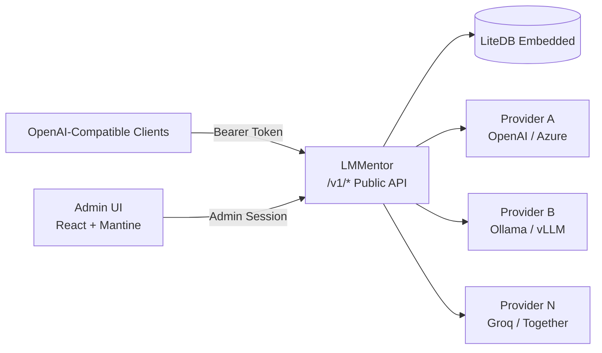

<p align="center">
  
</p>

<h1 align="center">LMMentor</h1>

<p align="center">
   <strong>Lightweight, self-hosted LLM aggregator written in C# / ASP.NET Core</strong><br/>
  <em>A single-binary, opinionated alternative to LiteLLM for routing, curating, and tracking multiple OpenAI-compatible LLMs.</em>
</p>

<p align="center">
  
  <a href="https://github.com/icavalheiro/lmmentor/actions/workflows/ci.yml"></a>
  <a href="https://github.com/icavalheiro/lmmentor/pkgs/container/lmmentor"></a>
  
   
  
  
  
</p>

<p align="center">
  <em>💡<strong>LMMentor</strong> should be read as "elementor" (el-uh-MEN-tor, /ˌɛl.əˈmɛn.tər/). </em>
</p>

---

> [!NOTE]
> **Mostly Complete**: LMMentor's core features (M1–M4) are implemented and working. Remaining hardening work is tracked in the roadmap below. See [IDEA.md](IDEA.md) for the detailed design specification.

---

## 🌟 Overview

**LMMentor** acts as a unified gateway sitting in front of your upstream LLM providers (OpenAI, Azure OpenAI, Ollama, vLLM, LM Studio, Groq, Together, etc.). It aggregates their models behind a single OpenAI-compatible API endpoint and provides an embedded web UI for administration, model curation, API token management, and real-time usage metrics.

### Why LMMentor?

- ⚡ **Simple Self-Hosted Deployment**: Runs as one ASP.NET Core service with no external database, queue, or cache required.
- 🗄️ **Embedded LiteDB Storage**: All providers, curated models, tokens, and daily metrics live in a single local database file (`.db`). Trivially deployable and easily backed up.
- 🔄 **OpenAI-Compatible In, OpenAI-Compatible Out**: Works out-of-the-box with any standard OpenAI client or SDK (`/v1/chat/completions`, `/v1/models`).
- 🚀 **Low Latency & Memory-Efficient Streaming**: Passes tokens through via Server-Sent Events (SSE) with minimal buffering, low memory allocations, and connection pooling.
- 📊 **Built-in Admin Dashboard**: An integrated admin interface, featuring first-run credential bootstrap, model toggling, and generation speed metrics (avg tokens/sec).

---

## 🏗️ Architecture



---

## ✨ Key Features

1. **Multi-Provider Aggregation**
   - Configure multiple upstream OpenAI-compatible endpoints with custom base URLs, API tokens, and allow/deny lists.
2. **Automated Model Discovery**
   - Discovers available models and their context window sizes from configured providers: vLLM/Groq report it in `GET /models` (`max_model_len`/`context_window`), Ollama via `/api/show`, LM Studio via its native REST API (`/api/v1/models`), and llama-server / Unsloth Studio via `GET /props`. Runs on demand, per endpoint, from the admin UI — no background polling, so every refresh re-reads the current context size.
3. **Model Curation & Aliasing**
   - Discovered models start **disabled**, so nothing is exposed to downstream clients without an explicit decision: enable only the models you want to use and assign friendly aliases for a clean, stable model catalog.
4. **Unified OpenAI-Compatible Endpoints**
   - `GET /v1/models`: Lists active exposed models with metadata.
   - `POST /v1/chat/completions`: Seamlessly routes requests and streams SSE responses.
5. **Usage & Speed Metrics**
   - Tracks calls and input/output tokens per request (usage is extracted from the upstream response, including streamed `usage` chunks) and aggregates them on the dashboard: daily trend, per-model and per-key breakdowns, and average **tokens per second** over the selected window.
6. **API Key Management**
   - Generate, scope (restricted to specific models), revoke, or delete `sk-lm-...` bearer keys for client applications. Keys are stored hashed; the full value is shown only once at creation.
7. **Zero-Config First Run Bootstrap**
   - Automatically generates secure admin credentials on first startup and outputs them to the console.

---

## 📂 Project Structure

```
lmmentor/
├── assets/                         # Identidade visual compartilhada (README + AdminUI)
│   ├── logo.svg                    # Logo do projeto (cristal do cajado + os quatro elementos)
│   ├── readme-logo.png             # Versão PNG do logo usada no README
│   ├── favicon.svg                 # Ícone de aba do AdminUI (mesma arte, em 64×64)
│   └── icons.svg                   # Sprite de ícones usado pelo AdminUI
├── src/
│   ├── LMMentor.slnx               # Solution file
│   ├── LMMentor.Backend/           # ASP.NET Core Native AOT backend (Minimal APIs)
│   │   ├── Program.cs              # Application entrypoint & routing
│   │   ├── Admin/                  # Auth, admin API (/api) e relay OpenAI-compatible (/v1)
│   │   ├── Data/                   # LiteDB services + entities (endpoints, models, keys, usage)
│   │   ├── Dev/                    # Vite dev server proxy middleware
│   │   └── wwwroot/                # Built Admin UI static assets
│   ├── LMMentor.Backend.UnitTests/         # xUnit unit tests (services, relay, discovery)
│   ├── LMMentor.Backend.IntegrationTests/  # xUnit end-to-end tests over the real HTTP pipeline
│   └── LMMentor.AdminUI/           # Admin UI (React + TypeScript + Vite + Mantine)
│       ├── src/                    # Frontend source code (pages, components, api) + Vitest tests
│       ├── e2e/                    # Playwright smoke tests against the real backend
│       └── vite.config.ts          # Vite config (build para wwwroot, publicDir em /assets)
├── .github/workflows/              # CI (lint, build, tests) e publicação da imagem no GHCR
├── Dockerfile                      # Multi-stage build: Vite → AOT publish → static binary
├── docker-compose.yml              # Host-network container with a /data volume for the DB
├── IDEA.md                         # Architecture & product specification
└── README.md
```

---

## 🗺️ Roadmap & Milestones

- [x] **M1 — Skeleton & Bootstrapping**: AOT application bootstrapper, embedded LiteDB initialization, admin credential bootstrap, minimal UI shell.
- [x] **M2 — Providers & Discovery**: Endpoint CRUD, connection status checks, automated model discovery (OpenAI-compatible + Ollama) with context sizing, model renaming and exposure toggles.
- [x] **M3 — Public OpenAI-Compatible API**: Bearer-key authentication (`sk-lm-...`), `/v1/models`, `/v1/chat/completions` with SSE streaming pass-through.
- [x] **M4 — Metrics & Dashboard**: Per-call tracking, dashboard aggregation (daily trend, per-model/per-key breakdowns, avg tokens/sec) and on-demand model refresh from the admin UI.
- [ ] **M5 — Ongoing Hardening**: Memory and latency profiling of the relay path, release artifacts. Automated tests (unit + integration), CI and published container images are done.

---

## 🛠️ Development Setup

### Prerequisites

- [.NET 10 SDK](https://dotnet.microsoft.com/)
- [Node.js](https://nodejs.org/) (v20+) & `npm`

### Running in Development Mode

When running in development (`ASPNETCORE_ENVIRONMENT=Development`), the backend automatically starts and proxies the Vite dev server for hot module replacement (HMR) under `/admin/`.

1. **Install Admin UI dependencies**:
   ```bash
   cd src/LMMentor.AdminUI
   npm install
   ```

2. **Run the Backend**:
   ```bash
   cd ../LMMentor.Backend
   dotnet watch run
   ```

3. Open your browser at `http://localhost:5000/admin/` (or the configured port).

> [!TIP]
> The Vite dev server runs on a strict port (`5173`). Set `LMMENTOR_DEV_PROXY=false` to serve the static build from `wwwroot` even in Development.

### Running the Test Suite

```bash
# backend: unit tests (services, relay, model discovery) + integration tests (real HTTP pipeline)
dotnet test src/LMMentor.slnx

# admin UI: component and API-client tests (Vitest + Testing Library + MSW)
cd src/LMMentor.AdminUI
npm test

# admin UI: end-to-end smoke against the real backend (Playwright)
npm run build            # the backend serves the UI build from wwwroot
npx playwright install chromium
npm run test:e2e
```

- `src/LMMentor.Backend.UnitTests` exercises the data services in isolation against a temporary LiteDB file and a stubbed upstream provider.
- `src/LMMentor.Backend.IntegrationTests` boots the real application in memory with `WebApplicationFactory`, replaces the upstream HTTP client with a stub, and covers admin authentication, endpoint/model/key management, the OpenAI-compatible relay (including SSE streaming) and usage accounting.
- `src/LMMentor.AdminUI/src/**/*.test.tsx` renders the real pages with their providers and intercepts the admin API with [MSW](https://mswjs.io/), covering login, key management, settings and the HTTP client contract.
- `src/LMMentor.AdminUI/e2e` starts the backend with a throwaway database, reads the bootstrap credentials it prints, and smoke-tests the served SPA in Chromium: login, dashboard navigation and the protected `/v1` relay.
- No test reaches the network or the real database: every run creates its own temporary `.db` file and fake provider.

Everything above runs on every push and pull request through the [CI workflow](.github/workflows/ci.yml), together with the Admin UI lint and build.

---

## 🐳 Running with Docker

### Using the published image

Images are built and published to the GitHub Container Registry by the [Docker workflow](.github/workflows/docker.yml) on every push to `main` and on every `v*.*.*` tag.

```bash
docker run -d --name lmmentor \
  -p 6565:6565 \
  -e ASPNETCORE_URLS=http://+:6565 \
  -v lmmentor-data:/data \
  --add-host host.docker.internal:host-gateway \
  ghcr.io/icavalheiro/lmmentor:latest

# first-run admin credentials are printed to the container logs
docker logs lmmentor
```

Available tags: `latest` (default branch), `main`, `X.Y.Z` / `X.Y` (release tags) and `sha-<commit>`.

### Building locally with Compose

The multi-stage `Dockerfile` builds the Admin UI and publishes the backend into an ASP.NET Core runtime image, running as a non-root user.

```bash
docker compose up -d --build
```

To run the published image instead of building it, replace `build: .` with `image: ghcr.io/icavalheiro/lmmentor:latest` in [docker-compose.yml](docker-compose.yml).

### Configuration

| Variable | Default (image) | Description |
| --- | --- | --- |
| `ASPNETCORE_URLS` | `http://+:8080` | Listening address and port inside the container. |
| `LMMENTOR_DB_PATH` | `/data/lmmentor.db` | LiteDB file path; keep it on the `/data` volume so data survives upgrades. |

The compose file publishes port **6565**. When an upstream provider runs on the Docker host, configure it as `http://host.docker.internal:<port>` from the admin UI. Open `http://localhost:6565/admin/` and use the credentials printed to the container logs on first run.

> [!IMPORTANT]
> The database volume and the admin UI provide administrative access to configured providers. Restrict access to both, use HTTPS through a reverse proxy for non-local deployments, and keep Ollama compatibility disabled unless it is required.

---

## 🔌 VS Code BYOK with Ollama

LMMentor can emulate the Ollama discovery API expected by the native VS Code BYOK provider. Enable **Settings → Ollama compatibility** in the admin UI to expose `GET /api/version`, `GET /api/tags`, and `POST /api/show`; enabled public models are then discovered automatically by VS Code.

In **Manage Language Models** in VS Code, add an **Ollama** provider and set its URL to `http://localhost:6565` (without `/v1`). The native provider has no API-key field. Consequently, compatibility mode makes the public `/v1` relay accept any API key, including no key. Keep it disabled for internet-accessible deployments.

---

## 🤝 Contributing

Pull requests are welcome. Before opening one:

1. Run `dotnet test src/LMMentor.slnx` and add tests covering the new behaviour.
2. Run `npm run lint`, `npm test` and `npm run build` in `src/LMMentor.AdminUI` when the admin UI changes (the build emits into `LMMentor.Backend/wwwroot`, which the backend serves in production).
3. Run `npm run test:e2e` when a change affects how the backend serves the SPA, authentication or the public relay.
4. Keep the container image working: the Docker workflow builds the image and smoke-tests `/api/health` on every pull request.

---

## 📄 License

This project is licensed under the [GNU Affero General Public License v3.0 (AGPL-3.0)](LICENSE).
