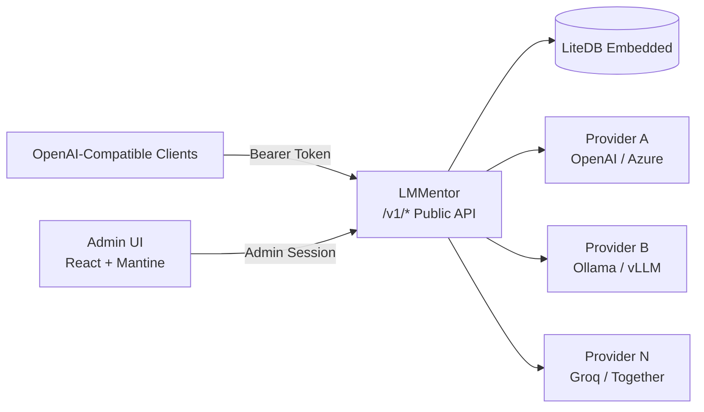

<p align="center">
  
</p>

<h1 align="center">LMMentor</h1>

<p align="center">
  <strong>Lightweight, self-hosted LLM aggregator written in C# / ASP.NET Core Native AOT</strong><br/>
  <em>A single-binary, opinionated alternative to LiteLLM for routing, curating, and tracking multiple OpenAI-compatible LLMs.</em>
</p>

<p align="center">
  
  
  
  
  
  
</p>

<p align="center">
  <em>💡<strong>LMMentor</strong> should be read as "elementor" (el-uh-MEN-tor, /ˌɛl.əˈmɛn.tər/). </em>
</p>

---

> [!WARNING]
> **Under Heavy Development**: LMMentor is in early active development. Features, APIs, and data structures are subject to breaking changes. See [IDEA.md](IDEA.md) for the detailed design specification and roadmap.

---

## 🌟 Overview

**LMMentor** acts as a unified gateway sitting in front of your upstream LLM providers (OpenAI, Azure OpenAI, Ollama, vLLM, LM Studio, Groq, Together, etc.). It aggregates their models behind a single OpenAI-compatible API endpoint and provides an embedded web UI for administration, model curation, API token management, and real-time usage metrics.

### Why LMMentor?

- ⚡ **Single Binary, Zero External Dependencies**: Compiled with .NET Native AOT into a single standalone executable. No Python runtime, virtual environments, Docker daemons, or heavy dependencies required.
- 🗄️ **Embedded LiteDB Storage**: All providers, curated models, tokens, and daily metrics live in a single local database file (`.db`). Trivially deployable and easily backed up.
- 🔄 **OpenAI-Compatible In, OpenAI-Compatible Out**: Works out-of-the-box with any standard OpenAI client or SDK (`/v1/chat/completions`, `/v1/models`).
- 🚀 **Low Latency & Memory-Efficient Streaming**: Passes tokens through via Server-Sent Events (SSE) with minimal buffering, low memory allocations, and connection pooling.
- 📊 **Built-in Admin Dashboard**: An integrated admin interface, featuring first-run credential bootstrap, model toggling, and generation speed metrics (avg tokens/sec).

---

## 🏗️ Architecture



---

## ✨ Key Features

1. **Multi-Provider Aggregation**
   - Configure multiple upstream OpenAI-compatible endpoints with custom base URLs, API tokens, and allow/deny lists.
2. **Automated Model Discovery**
   - Automatically polls `GET /v1/models` from configured providers to discover available models and their context window sizes.
3. **Model Curation & Aliasing**
   - Select which discovered models are exposed to downstream clients and assign friendly aliases for a clean, stable model catalog.
4. **Unified OpenAI-Compatible Endpoints**
   - `GET /v1/models`: Lists active exposed models with metadata.
   - `POST /v1/chat/completions`: Seamlessly routes requests and streams SSE responses.
5. **Usage & Speed Metrics**
   - Tracks total calls, input/output tokens, cache hits/misses, and wall-clock generation time to calculate average **tokens per second** per model.
6. **API Token Management**
   - Generate, scope (restricted to specific models), and revoke bearer tokens for client applications.
7. **Zero-Config First Run Bootstrap**
   - Automatically generates secure admin credentials on first startup and outputs them to the console.

---

## 📂 Project Structure

```
lmmentor/
├── assets/                         # Identidade visual compartilhada (README + AdminUI)
│   ├── logo.svg                    # Logo do projeto (cristal do cajado + os quatro elementos)
│   ├── favicon.svg                 # Ícone de aba do AdminUI (mesma arte, em 64×64)
│   └── icons.svg                   # Sprite de ícones usado pelo AdminUI
├── src/
│   ├── LMMentor.slnx               # Solution file
│   ├── LMMentor.Backend/           # ASP.NET Core Native AOT backend
│   │   ├── Program.cs              # Application entrypoint & routing
│   │   ├── Dev/                    # Vite dev server proxy middleware
│   │   └── wwwroot/                # Built Admin UI static assets
│   └── LMMentor.AdminUI/           # Admin UI (React + TypeScript + Vite + Mantine)
│       ├── src/                    # Frontend source code (pages, components, api)
│       └── vite.config.ts          # Vite config (build para wwwroot, publicDir em /assets)
├── IDEA.md                         # Architecture & product specification
└── README.md
```

> [!NOTE]
> Os arquivos de `/assets` são a única fonte de verdade da identidade visual: o README usa `assets/logo.svg`
> diretamente e o AdminUI os consome via `publicDir` do Vite (não existem cópias dentro de `src/`).

---

## 🗺️ Roadmap & Milestones

- [ ] **M1 — Skeleton & Bootstrapping**: AOT application bootstrapper, embedded LiteDB initialization, admin credential bootstrap, minimal UI shell.
- [ ] **M2 — Providers & Discovery**: Provider CRUD, connection testing, automated model discovery with context sizing, model exposure toggles.
- [ ] **M3 — Public OpenAI-Compatible API**: Bearer-token authentication, `/v1/models`, `/v1/chat/completions` with SSE streaming pass-through.
- [ ] **M4 — Metrics & Dashboard**: Per-call tracking, daily aggregation, prompt caching statistics, tokens/sec charts.
- [ ] **M5 — Hardening & Release**: Token scoping, scheduled background refresh, memory and latency profiling, single-file AOT distribution binaries.

---

## 🛠️ Development Setup

### Prerequisites

- [.NET 10 SDK](https://dotnet.microsoft.com/) (with Native AOT prerequisites installed for your OS)
- [Node.js](https://nodejs.org/) (v20+) & `npm`

### Running in Development Mode

When running in development (`ASPNETCORE_ENVIRONMENT=Development`), the backend automatically starts and proxies the Vite dev server for hot module replacement (HMR) under `/admin/`.

1. **Install Admin UI dependencies**:
   ```bash
   cd src/LMMentor.AdminUI
   npm install
   ```

2. **Run the Backend**:
   ```bash
   cd ../LMMentor.Backend
   dotnet watch run
   ```

3. Open your browser at `http://localhost:5000/admin/` (or the configured port).

---

## 📄 License

This project is licensed under the [GNU Affero General Public License v3.0 (AGPL-3.0)](LICENSE).
